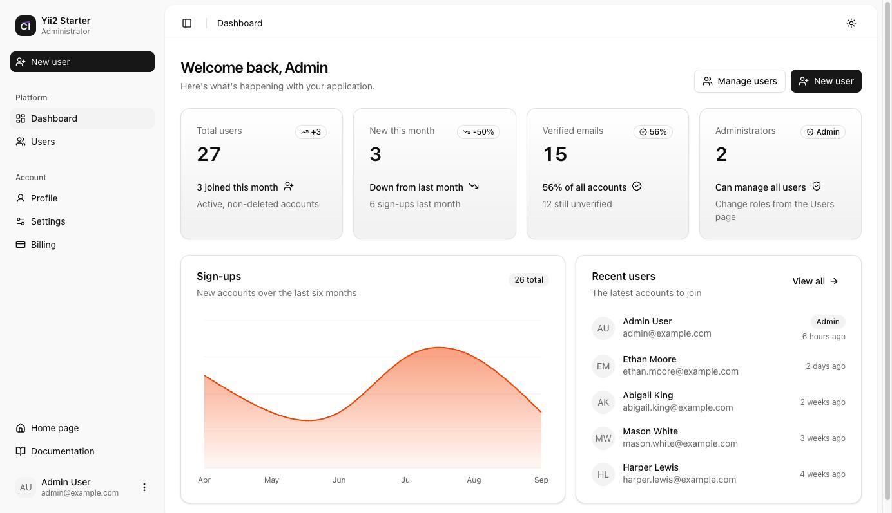
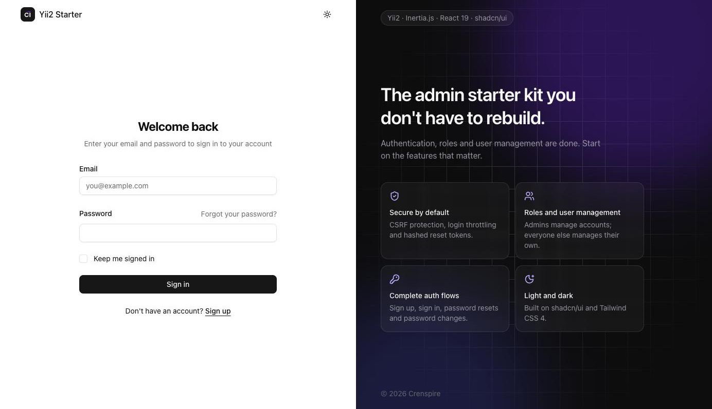
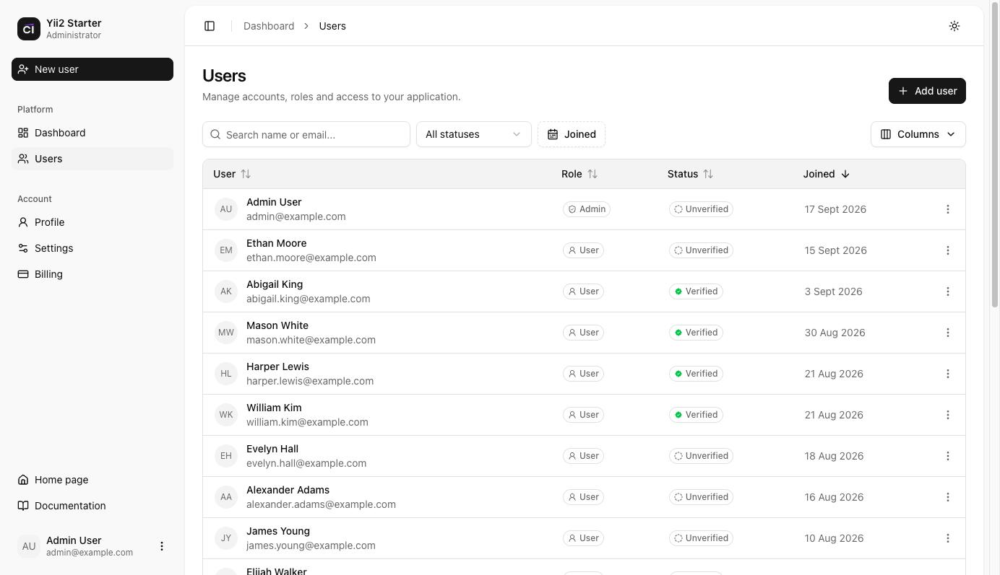
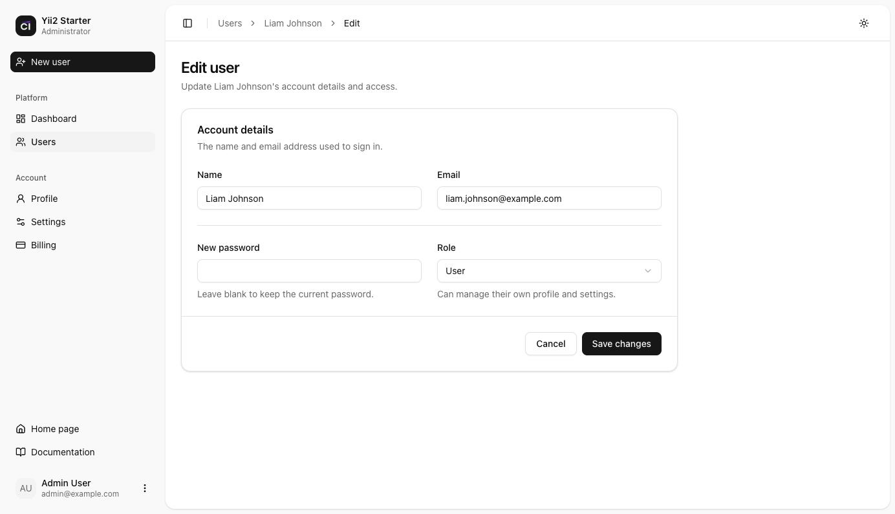
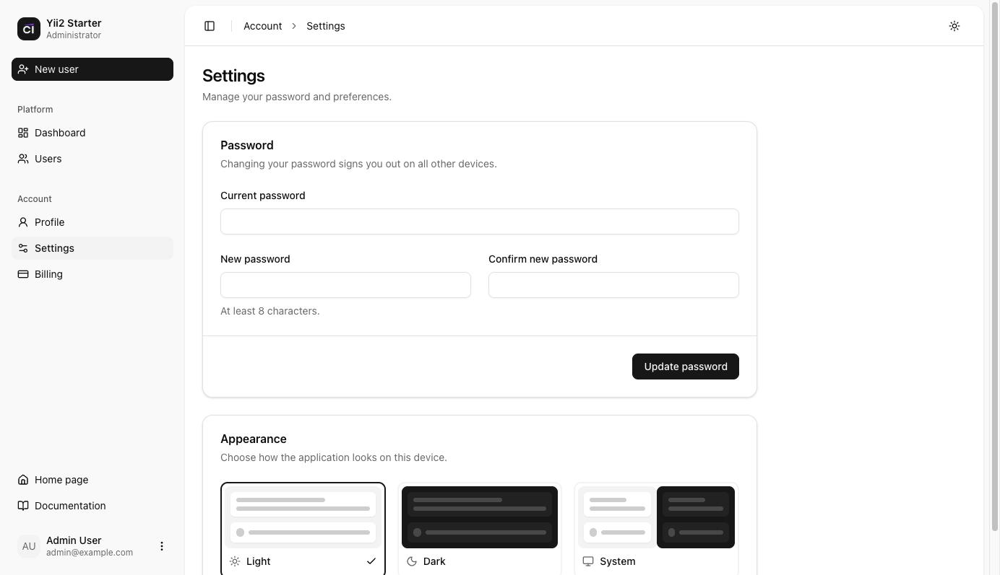

<p align="center">
  <picture>
    <source media="(prefers-color-scheme: dark)" srcset="web/logo-light.png">
    
  </picture>
</p>

<h1 align="center">Yii2 React Starter Kit</h1>

<p align="center">
  A modern <a href="https://www.yiiframework.com">Yii 2</a> application template with a React frontend powered by
  <a href="https://inertiajs.com">Inertia.js</a> and <a href="https://ui.shadcn.com">shadcn/ui</a>.<br>
  Authentication, roles and user management are done. Start on the features that matter.
</p>

<p align="center">
  
  
  
  
  
  
</p>

<p align="center">
  <a href="docs/getting-started.md"><strong>Getting started</strong></a> ·
  <a href="docs/README.md">Documentation</a> ·
  <a href="docs/building-a-feature.md">Build your first feature</a>
</p>

<p align="center">
  <picture>
    <source media="(prefers-color-scheme: dark)" srcset="docs/images/dashboard-dark.jpg">
    
  </picture>
</p>

## Features

- **Authentication:** sign in with "keep me signed in", registration, password resets by email, password changes
- **Roles:** `user` and `admin`, enforced on the server, manageable from the UI or the command line
- **User management:** searchable, sortable, paginated table with filters, column picker and row actions
- **Admin dashboard:** statistics, a sign-ups chart and recent users; members see their own account overview
- **Security:**
  - CSRF protection on every request
  - Login throttling, and responses that don't reveal which emails are registered
  - Hashed, single-use reset tokens
  - A password change signs out other sessions
  - Protection against mass assignment
- **shadcn/ui admin layout:** collapsible sidebar, breadcrumbs, user menu, light, dark and system themes
- **No API layer:** controllers return React pages with Inertia.js; server-side validation errors appear in forms
- **Tested:** Codeception unit and functional tests that run on SQLite with no setup

## Tech stack

| Backend | Frontend | Tooling |
| --- | --- | --- |
| Yii 2.0 on PHP 8.2+ | React 19 | Vite 6 |
| [crenspire/yii2-inertia](https://github.com/crenspire/yii2-inertia) 2.0 | Inertia.js v3 | Codeception 5 |
| MySQL / MariaDB | shadcn/ui, Radix UI, Tailwind CSS 4 | ESLint |
| Symfony Mailer | lucide icons, Recharts, Geist font | Docker Compose |

## Quick start

```bash
git clone git@github.com:crenspire/yii2-react-starter.git my-app
cd my-app
composer install && npm install

cp .env.example .env        # set COOKIE_VALIDATION_KEY and the database credentials
php yii migrate
php yii seed/admin admin@example.com

npm run serve               # http://localhost:8080
```

Requirements: PHP 8.2+, Composer, Node.js 22+ and MySQL or MariaDB. See [Getting started](docs/getting-started.md) for
details.

## Screenshots

<table>
  <tr>
    <td width="50%">
      <picture>
        <source media="(prefers-color-scheme: dark)" srcset="docs/images/login-dark.jpg">
        
      </picture>
      <p align="center">Sign in</p>
    </td>
    <td width="50%">
      <picture>
        <source media="(prefers-color-scheme: dark)" srcset="docs/images/users-dark.jpg">
        
      </picture>
      <p align="center">User management</p>
    </td>
  </tr>
  <tr>
    <td width="50%">
      <picture>
        <source media="(prefers-color-scheme: dark)" srcset="docs/images/user-form-dark.jpg">
        
      </picture>
      <p align="center">Edit user</p>
    </td>
    <td width="50%">
      <picture>
        <source media="(prefers-color-scheme: dark)" srcset="docs/images/settings-dark.jpg">
        
      </picture>
      <p align="center">Settings</p>
    </td>
  </tr>
</table>

Screenshots follow your GitHub theme: switch between light and dark mode to see both.

## Documentation

| | |
| --- | --- |
| [Getting started](docs/getting-started.md) | Installation, first admin user, development servers |
| [Configuration](docs/configuration.md) | Environment variables, email, frontend assets |
| [Architecture](docs/architecture.md) | How requests become React pages, shared props, redirects, errors |
| [Authentication and roles](docs/authentication.md) | Sign-in security, password resets, roles, access control |
| [Frontend](docs/frontend.md) | Pages, layouts, components, forms, theming |
| [Building a feature](docs/building-a-feature.md) | Step-by-step walkthrough from migration to tests |
| [Testing](docs/testing.md) | Unit and functional tests and their helpers |
| [Deployment](docs/deployment.md) | Production checklist, Nginx, Apache, Docker |
| [Troubleshooting](docs/troubleshooting.md) | Common problems and fixes |

The Inertia adapter has its own documentation at
[crenspire.github.io/yii2-inertia](https://crenspire.github.io/yii2-inertia/).

## License

Released under the BSD-3-Clause license. See [LICENSE.md](LICENSE.md).
